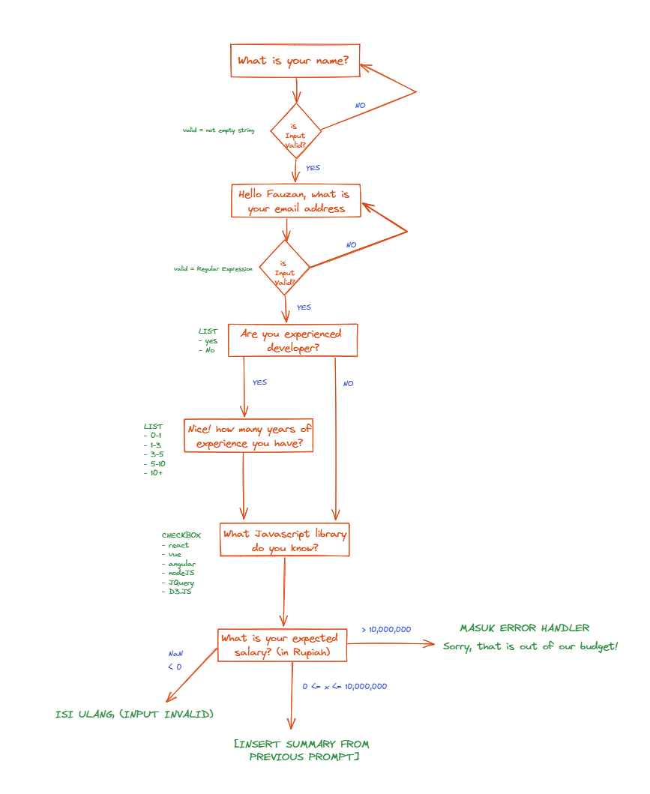

# Developer Survey CLI

- Assignment Example for Week 7: Programming — JavaScript, Node.js, npm, TypeScript

We will make Developer Survey using CLI and JavaScript

## Prerequisites

- Node.js
- NPM
  - Inquirer
- JavaScript
- Terminal

You can use starter code from folder starter

- What's your first name?
  Rules

  - Input type "input"
  - Validate not empty

- Hello (name from question 1) What's your email address?
  Rules

  - Input type "input"
  - Validate not empty

- Are you experienced Developer?
  Rules

  - Input type "list", [yes, no]
  - Validate not empty

- How many years of experience you have with JavaScript?
  Rules

  - Input type "list", ["0-1", "1-3", "3-5", "5-10", "10+"]
  - Validate not empty
  - Only show if question 3 selected "yes"

- What JavaScript library do you know?
  Rules

  - Input type "checkbox", ["React.js", "Vue", "Angular", "Node.js", "jQuery", "D3.js"]
  - Validate not empty
  - Only show if question 3 selected "yes"

- What is your desired salary?
  Rules
  - Input type "number"
  - Validate salary more than zero
  - Only show if question 3 selected "yes"

## Flowchart

Based from prerequisite questions above, we made flowchart to make things easier.

We made some modifications for the answers, such as:

1. Using regex to make correct format when entering email.
2. If we choose NO for question regarding software development question, it will ask immediately about Javascript library instead of asking how many years of working experience.
3. Making some options where invalid answers will return error message when entering invalid number of desired salary, salary under and above 10.000.000.

## Loom

[Loom video to show how the survey looks like](https://www.loom.com/share/87475f6f81be4d1d888a66b1c464bf4f)
